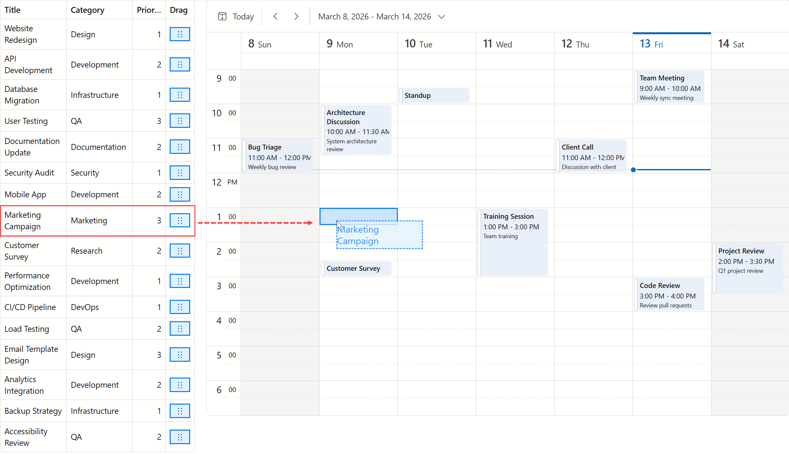

<!-- default badges list -->

[](https://supportcenter.devexpress.com/ticket/details/T1318444)
[](https://docs.devexpress.com/GeneralInformation/403183)
[](#does-this-example-address-your-development-requirementsobjectives)
<!-- default badges end -->
# Blazor Grid and Scheduler - Drag & Drop Items Between Components

This example allows you to drag & drop items from the [DevExpress Blazor Grid](https://docs.devexpress.com/Blazor/DevExpress.Blazor.DxGrid) to the [DevExpress Blazor Scheduler](https://docs.devexpress.com/Blazor/DevExpress.Blazor.DxScheduler). While both our Grid and Scheduler components support drag & drop operations within their own boundaries, this example implements custom drag & drop between the two components.



## Main Page Structure

See [Index.razor](./CS/Components/Pages/Index.razor).

- The [DragDropProvider](#drag--drop-provider) component wraps [Grid](https://docs.devexpress.com/Blazor/DevExpress.Blazor.DxGrid) and [Scheduler](https://docs.devexpress.com/Blazor/DevExpress.Blazor.DxScheduler) components and implements drag & drop logic.
- The [DevExpress Blazor Stack Layout](https://docs.devexpress.com/Blazor/DevExpress.Blazor.DxStackLayout) component arranges [Grid](https://docs.devexpress.com/Blazor/DevExpress.Blazor.DxGrid) and [Scheduler](https://docs.devexpress.com/Blazor/DevExpress.Blazor.DxScheduler) components on a page.

### Blazor Grid Configuration

See [Blazor Grid Markup](./CS/Components/Pages/Index.razor#L24).

- A `DxGridCommandColumn` template renders a drag handle.
- The `drag-handle` CSS class is used to locate the handle in JavaScript.
- `data-item-index="@context.VisibleIndex"` identifies the dragged row.
- `CssClass="grid-container"` allows JavaScript to locate the grid.

    ```Razor
    <DxGrid Data="@GridItems"
            CssClass="grid-container"
            AllowDragRows="false">
        <Columns>
            <DxGridCommandColumn>
                <CellDisplayTemplate>
                    <div class="drag-handle"
                        data-item-index="@context.VisibleIndex">
                        ⋮⋮
                    </div>
                </CellDisplayTemplate>
            </DxGridCommandColumn>
            @* ... *@
        </Columns>
    </DxGrid>
    ```

### Blazor Scheduler Configuration

See [Blazor Scheduler Markup](./CS/Components/Pages/Index.razor#L50).

- `CssClass="scheduler-container drop-zone"` is used to detect the drop zone within the Scheduler component using JavaScript.

    ```Razor
    <DxScheduler DataStorage="@DataStorage"
                CssClass="scheduler-container drop-zone">
        @* ... *@
    </DxScheduler>
    ```

## Drag & Drop Implementation

### Client-Side Scripts

See [drag-drop.js](./CS/wwwroot/js/drag-drop.js).

Main event handlers:

* [handleMouseDown](./CS/wwwroot/js/drag-drop.js#L38) - Handles the start of a drag operation.

    ```js
    function handleMouseDown(e) {
        isDragging = true;
        currentHandle = e.currentTarget;
        
        if (dotNetHelper) {
            dotNetHelper.invokeMethodAsync('NotifyDragStart', x, y, index);
        }
        
        document.addEventListener('mousemove', handleMouseMove);
        document.addEventListener('mouseup', handleMouseUp);
    }
    ```

* [handleMouseMove](./CS/wwwroot/js/drag-drop.js#L59) - Updates drag preview position and highlights drop zones.

    ```js
    function handleMouseMove(e) {
        const itemIndex = currentHandle?.getAttribute('data-item-index');
        const index = itemIndex ? parseInt(itemIndex, 10) : null;
        
        if (dotNetHelper) {
            dotNetHelper.invokeMethodAsync('NotifyDragMove', x, y, index);
        }
        
        checkDropZoneCell(x, y);
    }
    ```

* [handleMouseUp](./CS/wwwroot/js/drag-drop.js#L167) - Finalizes the drag operation and processes the drop.

    ```js
    function handleMouseUp(e) {
        isDragging = false;
        if (dotNetHelper) {
            dotNetHelper.invokeMethodAsync('NotifyDragEnd', x, y, index);
        }
        
        clearHighlight();
        
        document.removeEventListener('mousemove', handleMouseMove);
        document.removeEventListener('mouseup', handleMouseUp);
        currentHandle = null;
    }
    ```

### C# Implementation

See [Index.razor](./CS/Components/Pages/Index.razor#L105).

Main event handlers:

- [HandleDragStart](./CS/Components/Pages/Index.razor#L101) - Stores dragged item data and renders the drag preview.

    ```csharp
    private void HandleDragStart(DragDropProvider.DragStartEventArgs args) {
        currentDropCell = null;
        draggedGridItem = null;

        if(args.ItemIndex.HasValue) {
            var dataItem = grid.GetDataItem(args.ItemIndex.Value);
            if(dataItem != null) {
                draggedGridItem = (GridItemData)dataItem;
            }
        }
    ```

- [HandleDragEnterDropZone](./CS/Components/Pages/Index.razor#L130) - Stores target cell information.

    ```csharp
    private void HandleDragEnterDropZone(DragDropProvider.DragEnterDropZoneEventArgs args) {
        currentDropCell = args.CellInfo;
    }
    ```

- [HandleDragLeaveDropZone](./CS/Components/Pages/Index.razor#L134) - Clears target cell information.

    ```csharp
    private void HandleDragLeaveDropZone() {
        currentDropCell = null;
    }
    ```

- [HandleDragEnd](./CS/Components/Pages/Index.razor#L122) - Handles the drop event.

    ```csharp
    private async Task HandleDragEnd(DragDropProvider.DragEndEventArgs args) {
        if(currentDropCell != null && draggedGridItem != null) {
            await CreateAppointmentFromGrid(currentDropCell, draggedGridItem);
            currentDropCell = null;
            draggedGridItem = null;
        }
    }
    ```

- [CreateAppointmentFromGrid](./CS/Components/Pages/Index.razor#L138) - Creates a new appointment from the dragged item data.

    ```csharp
        private async Task CreateAppointmentFromGrid(DropZoneCellInfo cellInfo, GridItemData gridItem) {
            var newAppointmentItem = await scheduler.CreateAppointmentAsync(cellInfo.Start, cellInfo.End, cellInfo.IsAllDay, null);
            newAppointmentItem.Subject = gridItem.Title;
            newAppointmentItem.Description = $"Category: {gridItem.Category}\nPriority: {gridItem.Priority}\n\n{gridItem.Description}";
            await scheduler.SaveAppointmentAsync(newAppointmentItem);
        }
    ```

### Drag & Drop Provider

See [DragDropProvider.razor](./CS/Components/DragDropProvider.razor).

- The provider stores [DragAndDropHelper](#drag--drop-helper) and a drag template, registers required JavaScript/C# events, and exposes event handlers via parameters.
- Both the Grid and Scheduler [are wrapped](./CS/Components/Pages/Index.razor#L11) within this provider.

### Drag & Drop Helper

See [DragAndDropHelper.cs](./CS/Helpers/DragAndDropHelper.cs).

<!-- feedback -->
## Does This Example Address Your Development Requirements/Objectives?

[](https://www.devexpress.com/support/examples/survey.xml?utm_source=github&utm_campaign=draft-blazor-grid-and-scheduler-drag-and-drop&~~~was_helpful=yes) [](https://www.devexpress.com/support/examples/survey.xml?utm_source=github&utm_campaign=draft-blazor-grid-and-scheduler-drag-and-drop&~~~was_helpful=no)

(you will be redirected to DevExpress.com to submit your response)
<!-- feedback end -->
